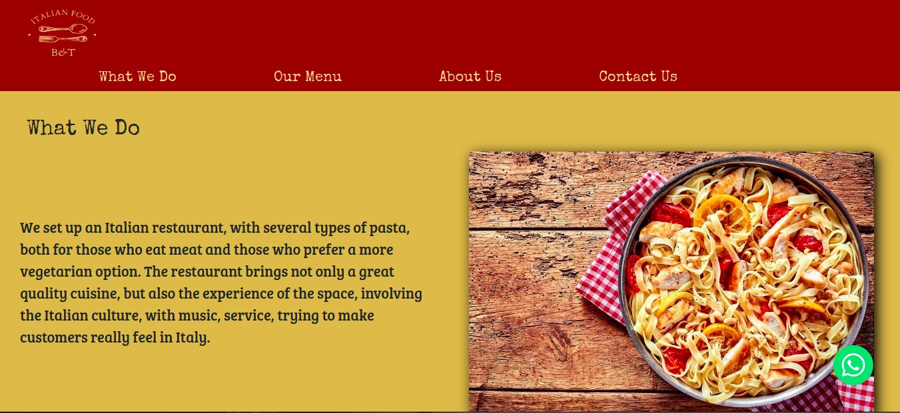

<h1 align = "center"> << Landing Page >> </h1>

This project started with the main purpose of practicing coding and, at the same time, having some fun on *pair programming* between friends. The ideia was to challenge ourselves to do somenthing new to us, understand our individual technical difficuties and together find a solution to each part of the project. No pressure, no right-wrong, just studying and making the most of it.
As we are food lovers, we were inspired by delicious Italian cuisine. 

### 🛠 Technologies used
* Node.js
* Express
* Nodemailer
* Vanilla Javascript
* HTML5
* CSS3
* Bootstrap

### 📖 Practiced
* Node.js, Express and serve on localhost
* Styling using Goodle Fonts, Font Awesome and Bootstrap
* Link to whatsapp contact
* Send email form to get in touch

### 🚧  Under construction... 
* Responsive page to mobile

### 🖥 Result:


### 🚀 Do you wanna clone it?
```bash
# Clone this repository
$ git clone https://github.com/BrunoDavanzo/landing-page.git

# Open the folder
$ cd landing-page

# Open VSCode
$ code .

# Install dependencies
$ npm install

# Run the application
$ npm start

# The server will start on port:3000 - access http://localhost:3000